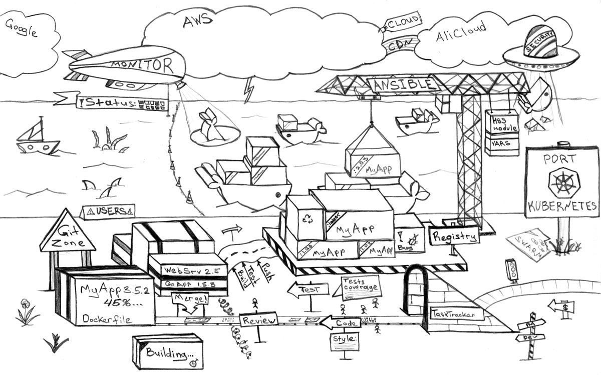
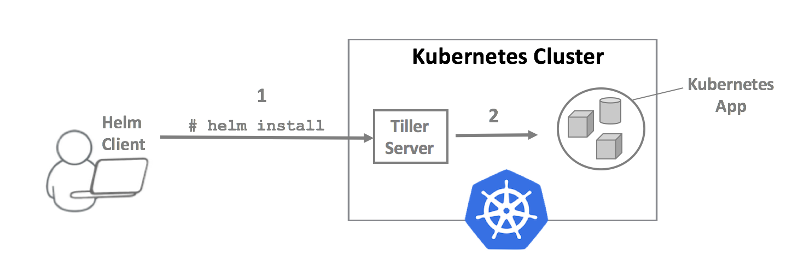
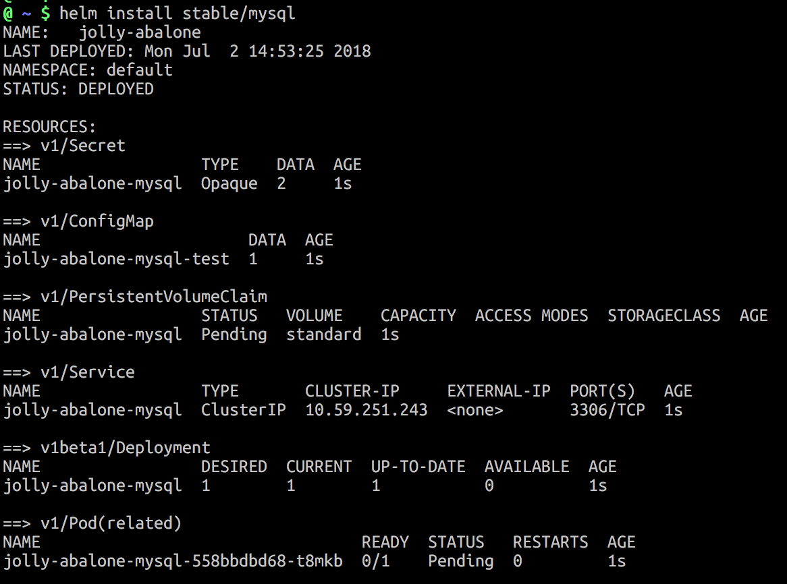

name: inverse
layout: true
class: left, middle, inverse
---
# Introduction to helm
The package manager for Kubernetes
---
# Life without helm
.center[]
---
# Helm's core values
- Installing resources in Kubernetes should be easy (like apt/yum/zipper/etc)
- Teams should be able to collaborate
- Release should be reproducible
- Packages should be sharable
---
# Architecture
.center[]
---
# Charts, repositories, releases
- __Charts:__  a boundle of Kubernetes resources (like operationg system package)
- __Repository:__ a collection of released charts (like Ubuntu repository)
- __Release:__ a chart that is loaded into Kubernetes
---
# Using helm
- `$ helm init ` set up helm for the first time
- `$ helm install <chart> ` install a chart
- `$ helm get/status/list ` find out about releases
- `$ helm repo add/list/remove ` manage your helm repositories
- `$ helm search <chart> ` search repos for charts
- `$ helm create/package ` create and package new chart
---
# Demo
.center[]
---
# Helm charts
## Mysql chart
```
.
├── Chart.yaml
├── README.md
├── templates
│   ├── NOTES.txt
│   ├── configurationFiles-configmap.yaml
│   ├── deployment.yaml
│   ├── initializationFiles-configmap.yaml
│   ├── pvc.yaml
│   ├── secrets.yaml
│   └── svc.yaml
└── values.yaml
```
---
# Charts.yaml
- Used for:
 - searching
 - official name
 - version information
 - finding the sources

```yaml
name: mysql
version: 0.8.2
appVersion: 5.7.14
description: Fast, reliable, scalable, and easy to use open-source relational database
keywords:
- mysql
- database
- sql
home: https://www.mysql.com/
icon: https://www.mysql.com/common/logos/logo-mysql-170x115.png
sources:
- https://github.com/kubernetes/charts
- https://github.com/docker-library/mysql
```
---
# Templates
- the Go Template language
- simple control structures (loops, conditionals, nesting)

```yaml
apiVersion: v1
kind: Service
metadata:
  name: {{ template "mysql.fullname" . }}
  labels:
    app: {{ template "mysql.fullname" . }}
    chart: "{{ .Chart.Name }}-{{ .Chart.Version }}"
    release: "{{ .Release.Name }}"
    heritage: "{{ .Release.Service }}"
spec:
  type: {{ .Values.service.type }}
  ports:
  - name: mysql
    port: {{ .Values.service.port }}
    targetPort: mysql
    {{- if .Values.service.nodePort }}
    nodePort: {{ .Values.service.nodePort }}
    {{- end }}
  selector:
    app: {{ template "mysql.fullname" . }}
```
---
# Values
- specify values that should be injected into templates
- simple YAML
- you can specify overrides externally
 - _helm install -f myvalues.yaml mychart_
 - _helm install mychart --set resources.requested.memory=512Mi_

```yaml
image: "mysql"
imageTag: "5.7.14"
resources:
  requests:
    memory: 256Mi
    cpu: 100m
...
```
---
# Resources
- helm docs [https://docs.helm.sh](https://docs.helm.sh)
- github repo [https://github.com/kubernetes/charts](https://github.com/kubernetes/charts)
