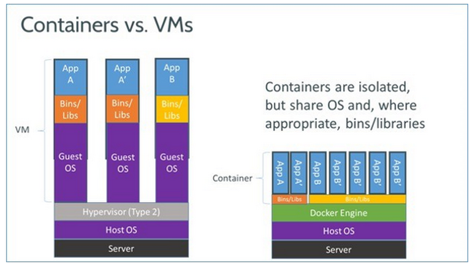
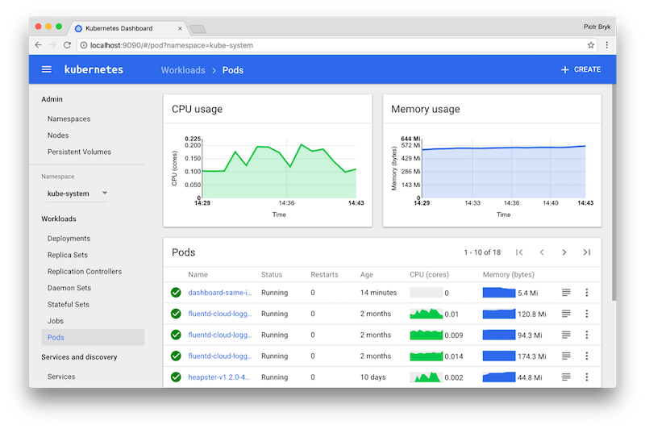
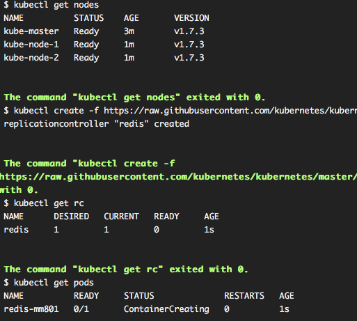
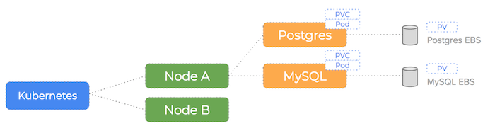
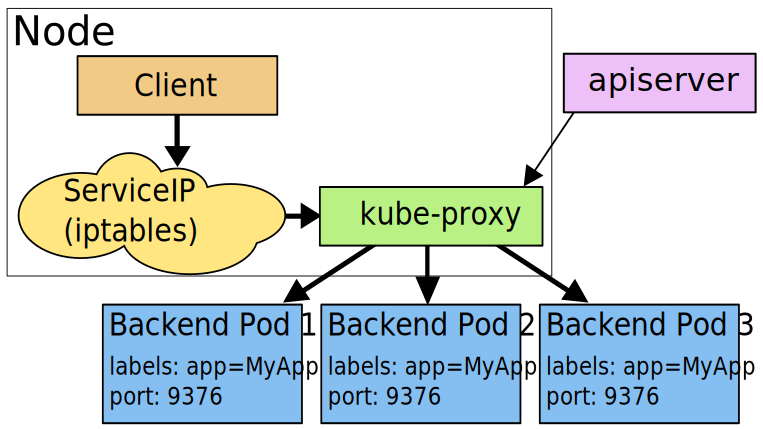
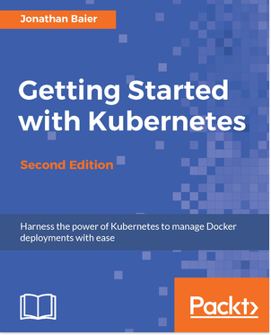

name: inverse
layout: true
class: left, middle, inverse
---
# Kubernetes 101
---
# Containers
.center[]
---
# Microservices and orchestration
.center[]
---
# What is Kubernetes

Kubernetes is an open-source system for automating deployment, scaling and management of containerized applications.
---
# Architecture

---
# Web-UI

---
# kubectl

---
# Objects
Kubernetes Objects are persistent entities in the Kubernetes system. Kubernetes uses these entities to represent the state of your cluster. 
Most often, you provide the information to kubectl in a .yaml file
---
# Core primitives
## Pod
- the atom of replication and placement
- small group of containers and volumes
- each pod gets an IP address
---
# Core primitives
## Pod
```yaml
apiVersion: v1
kind: Pod
metadata:
  name: nginx
  labels:
    name: nginx
spec:
  containers:
  - name: nginx
    image: nginx
    ports:
    - containerPort: 80
```
---
# Core primitives
## Volumes
.center[]

---
# Core primitives
## Volumes. Persistent volume
```yml
kind: PersistentVolume
apiVersion: v1
metadata:
  name: task-pv
spec:
  capacity:
    storage: 10Gi
  accessModes:
    - ReadWriteOnce
  awsElasticBlockStore:
    volumeID: vol-867g5kii
    fsType: ext4
```
---
# Core primitives
## Volumes. Persistent volume claim
```yml
kind: PersistentVolumeClaim
apiVersion: v1
metadata:
  name: task-pvc
spec:
  accessModes:
    - ReadWriteOnce
  resources:
    requests:
      storage: 5Gi
```
---
# Core primitives
## Volumes. Persistent volume claim
```yaml
kind: Pod
apiVersion: v1
metadata:
  name: task-pod
spec:
  containers:
    - name: task-container
      image: mysql:5.6
      ports:
        - containerPort: 3306
      volumeMounts:
        - mountPath: "/var/lib/mysql"
          name: task-pvc
  volumes:
    - name: task-volume
      persistentVolumeClaim:
       claimName: task-pvc
```
---
# Core primitives
## Volumes. Storage class
```yaml
kind: StorageClass
apiVersion: storage.k8s.io/v1
metadata:
  name: slow
provisioner: kubernetes.io/aws-ebs
parameters:
  type: io1
  zone: us-east-1d
  iopsPerGB: "10"
```
---
# Core primitives
## Volume types
- awsElasticBlockStore
- azureDisk
- azureFile
- cephfs
- configMap
- emptyDir
- fc (fibre channel)
- gcePersistentDisk
- gitRepo
- glusterfs
- hostPath
- iscsi
- nfs
- persistentVolumeClaim
- secret
- storageos
- vsphereVolume
- ...
---
# Core primitives
## Config maps
```yaml
apiVersion: v1
kind: ConfigMap
metadata:
  name: special-config
  namespace: default
data:
  special.level: very
  special.type: charm
```
---
# Core primitives
## Secrets
A Secret is an object that contains a small amount of sensitive data such as a password, a token, or a key. Each item must be base64 encoded.
```yaml
apiVersion: v1
kind: Secret
metadata:
  name: mysecret
type: Opaque
data:
  username: YWRtaW4=
  password: MWYyZDFlMmU2N2Rm
```
---
# Core primitives
## Using secrets
```yaml
apiVersion: v1
kind: Pod
metadata:
  name: mypod
spec:
  containers:
  - name: mypod
    image: redis
    volumeMounts:
    - name: foo
      mountPath: "/etc/foo"
      readOnly: true
  volumes:
  - name: foo
    secret:
      secretName: mysecret
```
---
# Core primitives
## Using secrets
```yaml
apiVersion: v1
kind: Pod
metadata:
  name: secret-env-pod
spec:
  containers:
  - name: mycontainer
    image: redis
    env:
      - name: SECRET_USERNAME
        valueFrom:
          secretKeyRef:
            name: mysecret
            key: username
      - name: SECRET_PASSWORD
        valueFrom:
          secretKeyRef:
            name: mysecret
            key: password
  restartPolicy: Never
```
---
# Core primitives
## Deployment
```yaml
apiVersion: apps/v1
kind: Deployment
metadata:
  name: nginx-deployment
  labels:
    app: nginx
spec:
  replicas: 3
  selector:
    matchLabels:
      app: nginx
  template:
    metadata:
      labels:
        app: nginx
    spec:
      containers:
      - name: nginx
        image: nginx:1.7.9
        ports:
        - containerPort: 80
```
---
# Core primitives
## Service
Service is an abstraction which defines a logical set of Pods and a policy by which to access them - sometimes called a micro-service.
```yaml
kind: Service
apiVersion: v1
metadata:
  name: my-service
spec:
  selector:
    app: MyApp
  ports:
  - protocol: TCP
    port: 80
    targetPort: 9376
```
---
# Core primitives
## Service

---
# Core primitives
## Service types.
- __ClusterIP__
- __NodePort__
- __LoadBalancer__
- __ExternalName__
---
# Core primitives
## Selectors
- user-provided key-value attributes
- attached to any API object
- queryable by selectors
- the only groupping mechanism
---
# Core primitives
## Other
- DeamonSet
- Jobs
- Namespaces (default, kube-system...)
- DNS
---
# Try Kubernetes
- __minikube__: runs a single-node Kubernetes cluster inside a VM on your laptop for users looking to try out Kubernetes.
- __kubeadm__: is a tool built to provide the best-practice “fast paths” for creating Kubernetes clusters.
- __katacoda__: learn Kubernetes using Interactive Browser-Based Scenarios
- __google kubernetes engine__: is a managed, production-ready environment for deploying containerized applications.

---
# Reading list
## Jonathan Baier, Getting Started with Kubernetes, Second edition, 2017
.center[]
